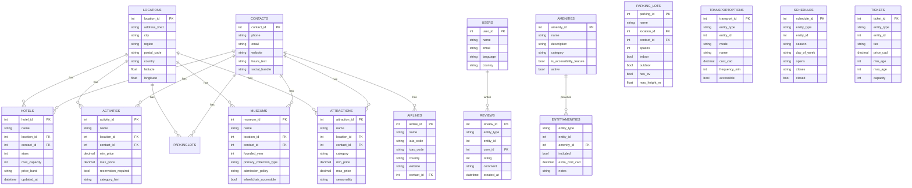

```mermaid
erDiagram
  LOCATIONS {
    int location_id PK
    string address_line1
    string city
    string region
    string postal_code
    string country
    float latitude
    float longitude
  }

  CONTACTS {
    int contact_id PK
    string phone
    string email
    string website
    string hours_text
    string social_handle
  }

  USERS {
    int user_id PK
    string name
    string email
    string language
    string country
  }

  AMENITIES {
    int amenity_id PK
    string name
    string description
    string category
    bool is_accessibility_feature
    bool active
  }

  HOTELS {
    int hotel_id PK
    string name
    int location_id FK
    int contact_id FK
    int stars
    int max_capacity
    string price_band
    datetime updated_at
  }

  ACTIVITIES {
    int activity_id PK
    string name
    int location_id FK
    int contact_id FK
    decimal min_price
    decimal max_price
    bool reservation_required
    string category_hint
  }

  PARKING_LOTS {
    int parking_id PK
    string name
    int location_id FK
    int contact_id FK
    int spaces
    bool indoor
    bool outdoor
    bool has_ev
    float max_height_m
  }

  MUSEUMS {
    int museum_id PK
    string name
    int location_id FK
    int contact_id FK
    int founded_year
    string primary_collection_type
    string admission_policy
    bool wheelchair_accessible
  }

  AIRLINES {
    int airline_id PK
    string name
    string iata_code
    string icao_code
    string country
    string website
    int contact_id FK
  }

  ATTRACTIONS {
    int attraction_id PK
    string name
    int location_id FK
    int contact_id FK
    string category
    decimal min_price
    decimal max_price
    string seasonality
  }

  REVIEWS {
    int review_id PK
    string entity_type
    int entity_id
    int user_id FK
    int rating
    string comment
    datetime created_at
  }

  TRANSPORTOPTIONS {
    int transport_id PK
    string entity_type
    int entity_id
    string mode
    string name
    decimal cost_cad
    int frequency_min
    bool accessible
  }

  SCHEDULES {
    int schedule_id PK
    string entity_type
    int entity_id
    string season
    string day_of_week
    string opens
    string closes
    bool closed
  }

  TICKETS {
    int ticket_id PK
    string entity_type
    int entity_id
    string tier
    decimal price_cad
    int min_age
    int max_age
    int capacity
  }

  ENTITYAMENITIES {
    string entity_type
    int entity_id
    int amenity_id FK
    bool included
    decimal extra_cost_cad
    string notes
  }

  LOCATIONS ||--o{ HOTELS : has
  CONTACTS  ||--o{ HOTELS : has

  LOCATIONS ||--o{ ACTIVITIES : has
  CONTACTS  ||--o{ ACTIVITIES : has

  LOCATIONS ||--o{ PARKINGLOTS : has
  CONTACTS  ||--o{ PARKINGLOTS : has

  LOCATIONS ||--o{ MUSEUMS : has
  CONTACTS  ||--o{ MUSEUMS : has

  LOCATIONS ||--o{ ATTRACTIONS : has
  CONTACTS  ||--o{ ATTRACTIONS : has

  CONTACTS  ||--o{ AIRLINES : has

  USERS ||--o{ REVIEWS : writes
  AMENITIES ||--o{ ENTITYAMENITIES : provides
```

